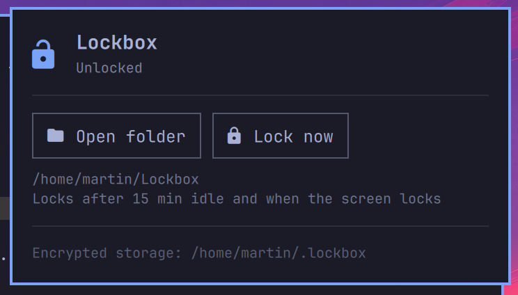

# Lockbox for Omarchy

An encrypted folder you unlock from the bar and that locks itself again.



Lockbox wraps [gocryptfs](https://nuetzlich.net/gocryptfs/): files you put in
`~/Lockbox` are stored encrypted, file by file, in `~/.lockbox`. No root, no
block devices, and the encrypted folder syncs and backs up like any other.

* Bar icon shows locked or unlocked. Left click opens the panel, right click
  locks, middle click opens the folder.
* Create a vault from the panel. The gocryptfs master key is shown once for
  recovery and never stored by the plugin.
* Auto-locks after a configurable idle time, using gocryptfs's own idle
  timer, and when the Omarchy screen lock engages.
* The password only ever goes to gocryptfs on stdin. It is never written to
  disk, never placed on a command line, and cleared from memory as soon as it
  is sent.

## Install

```bash
sudo pacman -S gocryptfs
omarchy plugin add https://github.com/marcho78/omarchy-lockbox.git --enable
```

Click the lock icon in the bar, type a password twice, and press Enter or
click **Create vault**. The panel then shows the recovery master key once.
Copy it somewhere safe and click **I saved it**. The vault unlocks and your
file manager opens `~/Lockbox`.

From then on: click the icon, type the password, Enter. Escape closes the
panel.

## Settings

```bash
omarchy bar set marcho78.lockbox autoLockMinutes 30
omarchy bar set marcho78.lockbox cipherDir ~/Sync/lockbox
omarchy bar set marcho78.lockbox lockOnScreenLock false
```

or edit the widget's entry under `bar.layout` in `~/.config/omarchy/shell.json`.

| Setting | Default | Meaning |
|---|---|---|
| `cipherDir` | `~/.lockbox` | Where encrypted files live. Sync or back up this folder. |
| `mountPoint` | `~/Lockbox` | Where the decrypted view appears while unlocked. |
| `autoLockMinutes` | `15` | Lock after this many minutes without file activity. `0` disables. |
| `lockOnScreenLock` | `true` | Lock when the screen locks. |
| `openAfterUnlock` | `true` | Open the folder in your file manager after unlocking. |

To use an existing gocryptfs directory, point `cipherDir` at it. Lock the
vault before changing either folder.

## IPC

```bash
omarchy-shell marcho78.lockbox status
omarchy-shell marcho78.lockbox lock
omarchy-shell marcho78.lockbox openFolder
omarchy-shell marcho78.lockbox toggle
```

## What it protects, and what it doesn't

Lockbox protects data at rest: a stolen or lost laptop, a backup, a sync
folder, a disk pulled from the machine. While the vault is unlocked, its files
are readable by any program running as your user, exactly like any other
folder. Lock it when you step away, or let the idle timer and screen lock do
it.

The encrypted folder contains `gocryptfs.conf`, which holds the master key
encrypted with your password. Back it up with the rest of the folder; without
it the data cannot be recovered even with the password.

The master key shown at creation opens the vault without the password. Treat
it like the password itself and keep it offline.

## Troubleshooting

* **"Something is still using the folder."** gocryptfs refuses to unmount while
  a file is open or a terminal is inside `~/Lockbox`. Close them and lock
  again.
* **Wrong password.** Passwords are case sensitive; the panel does not retry
  on its own.
* **The icon is dim.** gocryptfs is not installed or no vault exists yet. Open
  the panel for the exact message.

## Recovery

If you forget the password, gocryptfs can open the vault with the master key
shown at creation:

```bash
gocryptfs -masterkey <key> ~/.lockbox ~/Lockbox
```

## Remove

Lock the vault first, then:

```bash
omarchy plugin remove marcho78.lockbox
```

Your encrypted files stay in `cipherDir`. Delete that folder yourself if you no
longer want them. If the vault was still mounted, `fusermount3 -u ~/Lockbox`
unmounts it.

## Dependencies

* `gocryptfs` and `fuse3` from the Arch repos. Install gocryptfs yourself; the
  plugin never installs anything.
* `util-linux` for `findmnt` and `setsid`, `xdg-utils` for opening the folder,
  `wl-clipboard` for the copy buttons. All ship with Omarchy.

The plugin makes no network requests and writes only to the two folders you
configure. Every tool is called by absolute path.

## License

MIT

## Author

[@devsec_ai](https://x.com/devsec_ai) on X
